# comfyui-obvpm

ComfyUI nodes to save time and keep your workflows tidy. Bundle multiple wires into one wire. Create customizable presets nodes. Auto compose multiple images into reference sheets.

## Updates

**Also check out my new Timeline node:**  https://github.com/obvpm/comfyui-obvpm-timeline It not only lets you extend videos seamlessly, but also **prepend, bridge and even create seamless loops with motion context**!

### Latest HEAD

- Value Presets and Switches: Fixed on ComfyUI frontend 1.53 (ComfyUI 0.37) the preset chooser and a switch's `selected` dropdown were renamed `preset#1` / `selected#1` when the node was created, after which choosing a preset changed nothing and the prompt sent the wrong input name (issue #12). 
- Bundle: Fixed issue where if ComfyUI is set to a non-English language input pin names could use the translated output pin names of the upstream nodes causing breaks in the downstream Unbundle(s). Workflows need no changes, they will automatically work in the new version.

### 0.2.4 (2026-09-23)

- Value Presets: The schema editor now has an  **edit as text** button, which opens the schema as text to edit, paste into or copy from; *Use this schema* checks it and replaces the rows.
- Value Presets: fixed issue where couldn't save preset in ComfyUI Desktop (Electron)
- Value Presets: can now also rename presets
- Value Presets: the schema editor's *hint* column is now called *tooltip*, with a ✎ button that opens it in a bigger text box for editing
- Value Presets: fixed escape button closing the whole schema dialog instead of the popups
- Peek Bundle: fixed issue where it was not updating in Nodes 2.0
- Load Images & Compose + Load Image & Crop, Peek Bundle: fixed sizing issues in Nodes 2.0
- Bundle/Unbundle: fixed collapsed bundle/unbundle nodes showing nothing at all in Nodes 2.0 and having wrong wire position

### 0.2.3 (2026-09-22)

- Load Images & Compose: an empty node with no images now outputs `None` instead of raising an error. So you don't have to ctrl-b disable empty ones when eg. using one as a reference image input to MiniMax H3.
- Value Presets: a field can now depend on another one. Add `when turbo_loader != off` (or `when spectrum = true`, or `when mode = a, b` for any of several values) after a field's default, and the field is only shown while the choice or true/false field named holds one of those values. While hidden, its value on the bundle is `None` -- so a LoRA name sitting behind an "off" switch is never applied, and its widget no longer suggests that it is. The value is kept and comes back when the field does.
- Value Presets: a field can carry a hint. Put `# any text` at the end of its schema line and it shows when hovering over the widget.
- Value Presets: the schema editor has a `copy` button that copies the schema as text, and a `paste` button that replaces the fields with a pasted one (checked first; nothing changes on the node until Apply). The editor also has columns for the condition and the hint.
- The package published to the Comfy Registry no longer contains the tests and CI helpers, only the pack itself (`.comfyignore`).

## YouTube Intro Videos

To quickly see what these nodes are useful for, you can check out these YouTube videos that I made to introduce them

- [Load Images & Compose](https://www.youtube.com/watch?v=xjSflq85DqI) - Lets you compose ref images in a single node
- [Bundle Wires](https://www.youtube.com/watch?v=_j9aaXAmIzQ) - Lets you bundle multiple wires into a single wire
- [Value Presets Node](https://www.youtube.com/watch?v=gRt_NdzFjTw) - Lets you creat customizable presets for any workflow
- [Creating a Clean R2V Workflow with Customizable Presets](https://www.youtube.com/watch?v=4-TVn0TscmM) (the resulting workflow is [here](workflows/h3_obvpm_r2v.json))

## Support this work

If these nodes save you time, consider supporting their development on Patreon.

<a href="https://www.patreon.com/cw/obvpm"></a>

## Follow me for Updates

I'm working on more nodes and workflows, so follow me on X at https://x.com/chanons

## Installation

Clone (or copy) this folder into `ComfyUI/custom_nodes`:

```
cd ComfyUI/custom_nodes
git clone https://github.com/chanon/comfyui-obvpm
```

Restart ComfyUI. No extra Python dependencies are required.

Every node in this pack is listed with **(obvpm)** after its name, so searching the node menu for `obvpm` finds all of them. The names used throughout this document leave that suffix off.

## Nodes in this pack

**[Image nodes](#image-nodes-obvpmimage)** — obvpm/image

| Node                                                            | What it does                                                                 |
| --------------------------------------------------------------- | ---------------------------------------------------------------------------- |
| [Load Image & Crop](#load-image--crop)                          | Load Image with an interactive crop editor on the node                       |
| [Load Images & Compose](#load-images--compose)                  | Load multiple images, crop them, and then pack them into one reference image |
| [Downscale Image to Megapixels](#downscale-image-to-megapixels) | Scale an image down to a pixel budget, never up                              |

**[Value Presets](#value-presets)** — obvpm/bundle

| Node                            | What it does                                                |
| ------------------------------- | ----------------------------------------------------------- |
| [Value Presets](#value-presets) | Named presets from an editable template, output as a bundle |

**[Bundles](#bundles-obvpmbundle)** — obvpm/bundle

| Node                        | What it does                      |
| --------------------------- | --------------------------------- |
| [Bundle](#bundle)           | Pack several values onto one wire |
| [Unbundle](#unbundle)       | Expand a bundle back into wires   |
| [Peek Bundle](#peek-bundle) | Show what is on a bundle wire     |

**[Gates and Switches](#gates-and-switches)** — obvpm/gates, obvpm/switches

| Node                                                                                                                            | What it does                                            |
| ------------------------------------------------------------------------------------------------------------------------------- | ------------------------------------------------------- |
| [Optional Image / Video / Audio / Latent / Any](#optional-image--optional-video--optional-audio--optional-latent--optional-any) | Pass a value through; mute or bypass when it is missing |
| [Required Model](#required-model)                                                                                               | Refuse to queue until a model is wired in               |
| [Mute If](#mute-if)                                                                                                             | Block everything downstream on a boolean                |
| [Lazy Switch](#lazy-switch)                                                                                                     | Boolean two-way switch; only the chosen side runs       |
| [Lazy Switch 2 Values / 3 Values](#lazy-switch-2-values--3-values)                                                              | The same switch for two or three values together        |
| [Lazy Case Switch](#lazy-case-switch)                                                                                           | Pick a branch by name from a list you write             |
| [Lazy Case Switch (auto)](#lazy-case-switch-auto)                                                                               | Pick a branch by the title of the node feeding it       |

**[Misc](#misc)** — obvpm/values, obvpm/misc

| Node                                                                             | What it does                                              |
| -------------------------------------------------------------------------------- | --------------------------------------------------------- |
| [Dropdown](#dropdown)                                                            | A dropdown with choices you define                        |
| [First Float / First Int (else fallback)](#first-float--first-int-else-fallback) | First connected value, or a fallback                      |
| [Lora Name](#lora-name)                                                          | A LoRA file name on a wire                                |
| [Sampler Name](#sampler-name)                                                    | A sampler choice on a wire                                |
| [Scheduler Name](#scheduler-name)                                                | A scheduler choice on a wire                              |
| [Clean VRAM](#clean-vram-obvpmmisc)                                              | Unload models and free cached VRAM mid-graph              |
| [beta57 scheduler](#beta57-scheduler)                                            | Not a node: a scheduler added to every scheduler dropdown |

## Image nodes (obvpm/image)

### Load Image & Crop

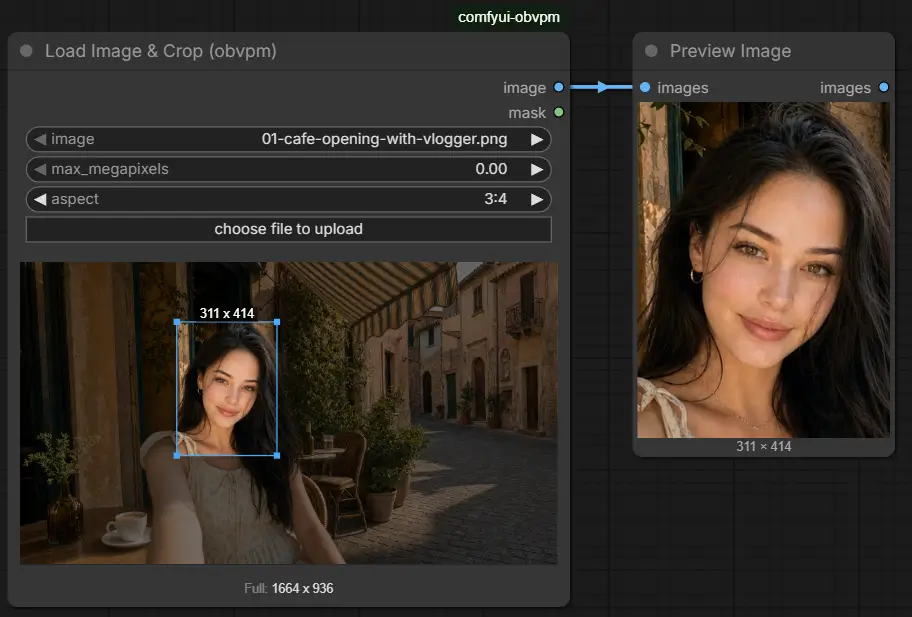

A Load Image with an interactive crop editor drawn directly on the node:

- **Drag** on the image to draw a crop area.
- **Drag inside** the selection to move it; **drag a corner** to resize.
- **Click** (without dragging) outside the selection to clear it.
- With no crop drawn, the full image is output.
- **Fixed aspect**: set `aspect` (16:9, 1:1, 4:5, …) and the crop rectangle keeps that shape while you draw, move or resize it — switching ratios snaps an existing crop in place (same center, same area). With no crop drawn, a dashed rectangle shows the largest centered cut of that ratio, which is what the node outputs. `free` is the unconstrained editor. A stored crop that disagrees with the ratio (hand-edited, or the aspect changed by wire) refuses at run time rather than being silently reshaped.

The label above the selection shows its size in source pixels; the row under the preview shows the full image size. If `max_megapixels` is greater than 0, the output (crop or full image) is scaled down to fit within it, aspect preserved — the preview labels show the resulting size as `Downscaled To:`. A value of `0` disables the cap.

| Input            | What it does                                                                         |
| ---------------- | ------------------------------------------------------------------------------------ |
| `image`          | The file to load. Upload, drag & drop, paste, or pick an existing input file.        |
| `crop`           | Managed by the crop editor; stored in normalized coordinates so it survives reloads. |
| `max_megapixels` | Downscale the output to fit this many megapixels. `0` disables.                      |
| `aspect`         | `free`, or a fixed ratio the crop keeps.                                             |

Outputs are `image` and `mask` (from the alpha channel, like the stock Load Image). Changing the crop re-executes the node on the next run. Works in both the classic canvas renderer and Nodes 2.0.

**Painting a mask**: right-click the node → **Open in MaskEditor** opens ComfyUI's own mask editor on the loaded file, exactly as on the stock Load Image. Saving writes a painted copy under the input folder's `clipspace` directory and points the node at it; the crop stays where it was (the copy has the source's size), and both `image` and `mask` come out cropped together.

### Load Images & Compose

Several input images, each with its own crop, composed into **one** image within a megapixel budget.

A node with no images outputs `None`, the same as an unconnected optional input, so a spare one can stay wired into a reference slot without being bypassed.

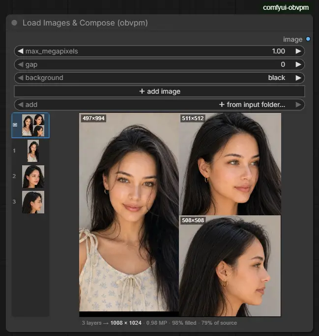

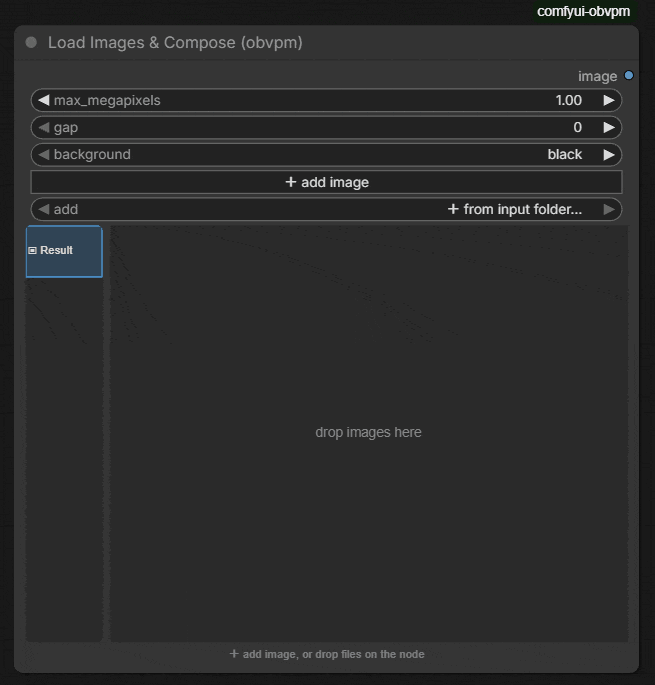

#### Editing

The node body is a layer strip on the left, a main view on the right, and one info line under both. Drag the divider between the strip and the view to widen the strip; its thumbnails grow with it, and the width is saved with the workflow. Entries keep their size however many layers there are, and the strip scrolls past what fits.

- **Add** an image with the `＋ add image` button (opens a file dialog and uploads), by picking one from the `add` dropdown (a live listing of the input folder, subfolders included), by **dropping image files onto the node**, or by **pasting an image from the clipboard** while the node is selected — each becomes a new layer. Cards dragged from the **Artius browser** work too; one already in the input folder is referenced in place rather than copied.

- **Select** a layer by clicking it in the strip. **Delete** it with the ✕ badge on the layer, or press Delete or Backspace while the pointer is over the node. Up and Down move the selection along the strip. **Reorder** by dragging a layer up or down the strip; the insertion point is drawn as you go.

- **Crop** the selected layer in the main view, exactly like [Load Image & Crop](#load-image--crop): drag to draw, drag inside to move, drag a corner to resize, click outside to clear. Each layer keeps its own crop, and the layout re-plans as you drag.

- **Per-layer aspect lock**: the `aspect: …` pill in the crop view opens a menu of fixed ratios (16:9, 1:1, 4:5, …). With a ratio set that layer's crop keeps the shape while drawing and resizing, switching ratios snaps the crop in place, and with no crop drawn a dashed rectangle shows the largest centered cut of that ratio — which is what composes. Each layer locks independently; `free` is the default.

- Under the image, next to the aspect pill: **duplicate** adds the same image again as a new layer (crop and aspect copied, inserted right after, selected); **delete** on the far right removes the layer — same action as the ✕ badge in the list.

- The first entry in the strip is **Result**: the real composition, at the real aspect ratio, each slot labelled with its pixel size. Its thumbnail in the strip is the composition too, so the sheet is visible without selecting it. Clicking a slot there jumps to that layer's crop editor.

The info line reads `4 layers → 1104 × 928 · 0.98 MP · 92% filled · 57% of source` — how much of the sheet is image, then the single scale factor being applied — and adds the selected layer's slot size.

#### How the layout is chosen

**Layers keep their order, their exact aspect ratio, and their relative pixel sizes.** Every one is scaled by the *same* factor and none is ever **enlarged**, so a 300×200 crop beside a 3000×2000 one comes out nine times smaller in area, because that is what it is. A small crop cannot take space from a large one by being stretched to fill a slot.

That makes `max_megapixels` a **cap, not a target**: four 256×256 images compose to a 512×512 sheet however large the budget, because enlarging them would be inventing pixels. Set it to `0` for no cap at all: every layer stays at its own size.

**Nothing is ever rotated.** A rotated reference is a wrong reference, so the quarter-turn a texture-atlas packer would take for free is not attempted at any point.

The packer sweeps 48 candidate sheet widths and four placement orders — your layer order, then tallest, widest and largest first. **Your order is the default answer** and is only displaced by an ordering that packs at least three points tighter, so dragging layers around still means something. The info line names the order actually used and how full the sheet came out.

#### Settings

| Setting          | What it does                                                                                                                                                                                                                      |
| ---------------- | --------------------------------------------------------------------------------------------------------------------------------------------------------------------------------------------------------------------------------- |
| `max_megapixels` | Largest the result may be (1.0 = 1024×1024 pixels) — a cap, not a target, so a sheet of small images comes out small. `0` = no cap (in `fill` sizing, a sheet of the sources' total area). Sides are rounded to a multiple of 16. |
| `gap`            | Pixels of background between layers. `0` puts them flush; a few pixels helps a model tell one reference from the next.                                                                                                            |
| `background`     | `black`, `grey` or `white` — seen in the gaps and in the up-to-16-pixel margin left by rounding.                                                                                                                                  |

The only output is `image`. Changing any crop, or the file behind any layer, re-executes the node on the next run.

### Downscale Image to Megapixels

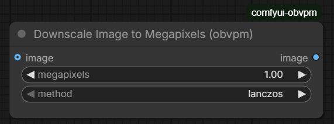

Scales an image down so its total pixel count fits within `megapixels`, keeping aspect ratio. Images already at or under the target (and on the `resolution_steps` grid) pass through completely untouched (no resample). With no image connected it outputs `None` (bypass). 1.0 megapixels = 1024×1024 pixels, matching ComfyUI's `ImageScaleToTotalPixels` convention.

| Input              | What it does                                                                                                                                                                             |
| ------------------ | ---------------------------------------------------------------------------------------------------------------------------------------------------------------------------------------- |
| `megapixels`       | Maximum output size. Larger images are scaled down to fit; smaller ones pass through.                                                                                                    |
| `method`           | Resampling filter: `lanczos` (default), `area`, `bicubic`, `bilinear`, `nearest-exact`.                                                                                                  |
| `resolution_steps` | Round the output width and height **down** to a multiple of this (default 32). `1` = no rounding. An image within the budget but off the grid is snapped too; nothing is ever scaled up. |
| `image`            | Optional. Unconnected outputs `None`.                                                                                                                                                    |

## Value Presets

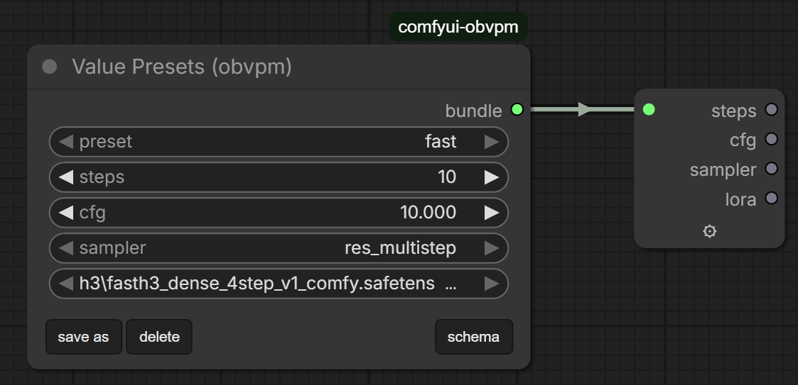

Named sets of values on one wire, from a template you edit in the graph. Its output is an ordinary [bundle](#bundles-obvpmbundle), unpacked with Unbundle.

This node keeps one copy of the structure and as many copies of the values as you like:

| Widget             | What it holds                                                               |
| ------------------ | --------------------------------------------------------------------------- |
| `schema` (hidden)  | the template: one field per line, with its type — edited through the dialog |
| `preset`           | which saved set is loaded — `custom` is whatever you set by hand            |
| `values` (hidden)  | what is set right now, keyed by name                                        |
| `presets` (hidden) | the saved sets, also keyed by name                                          |

Output: `bundle` — an ordinary bundle, so Unbundle works on it unchanged (hide fields in its config to take a subset), and Unbundle traces this node's field names exactly as it traces a Bundle's.

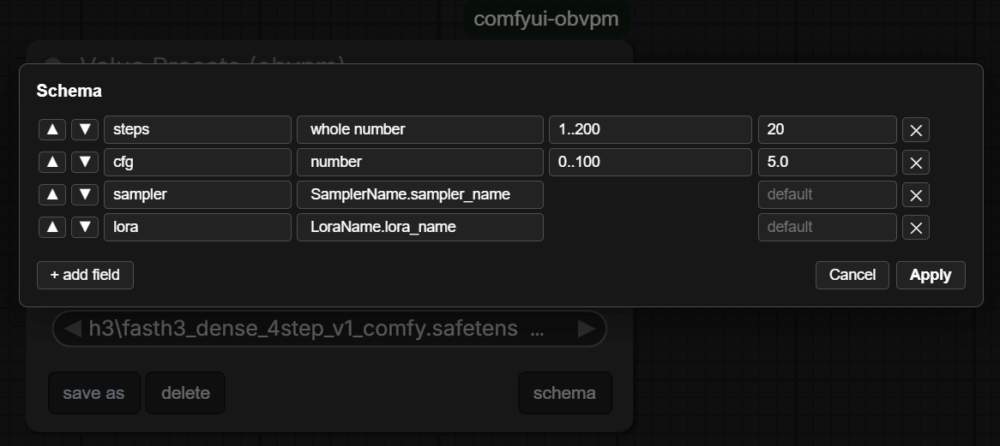

**Editing the template is cheap**, which is the point. Everything is keyed by name and nothing by position:

- **add** a field → every stored preset gains it at its default;
- **remove** one → the leftover value is ignored, not shifted onto the field after it;
- **reorder** them → nothing moves at all;
- **rename** one in the schema editor → its stored value is carried to the new name, in the node's own values *and in every preset*.

**Editing the fields.** Press **schema** for a row per field — name, type, range or choices, default, condition, tooltip (with a ✎ button that opens it in a larger box) — with ▲▼ to reorder and a searchable type picker. The picker offers the basic types and then **every dropdown on this install**. **edit as text** opens the schema as plain text, for pasting one in, copying this one out, or writing several lines at once; *Use this schema* checks it and replaces the rows (the node is only changed when you press Apply).

**The schema text.** One field per line: `name: type [range or choices] [= default] [when field = value] [# tooltip]`

```
turbo_loader: choice off, normal, larryvrh = off   # which loader applies the turbo LoRA
turbo_lora: @LoraName (obvpm).lora_name when turbo_loader != off
turbo_strength: float 0..1.00 = 1.0 when turbo_loader != off
steps: int 1..200 = 20
```

- **Types** are `text`, `int`, `float`, `bool`, `choice a, b, c`, and `@Node.input` to borrow another node's dropdown, which then tracks that list instead of a copy of it. A float range sets the decimals shown (`0..1.0` one, `0..1.00` two).
- **`when field = value`** (or `!=`, and `a, b` for any of several) shows the field only while a `choice` or `bool` field **declared above it** holds one of those values. While hidden, the field's value **on the bundle is `None`** — whatever is stored — so nothing downstream acts on a setting the node is not showing. The stored value is kept and returns with the field. A field whose deciding field is itself hidden is hidden too.
- **`# tooltip`** at the end of the line is shown when hovering over the field. (A `#` at the *start* of a line is a comment.)

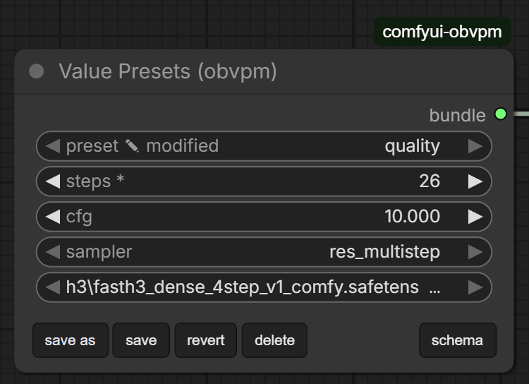

**What runs is what you see.** Selecting a preset writes its values into the controls, and they stay **editable**. Change one and the node does not quietly detach the label: it keeps saying which preset the values came from and marks itself modified.

**The row under the fields.** **save as preset** stores the current values under a new name. With a preset selected: **save** writes your edits into it and **revert** puts its values back (both only while something is modified), **rename** gives it another name with its values kept, and **delete** removes it (the values stay on the node). **schema** opens the field editor.

## Bundles (obvpm/bundle)

Packs several values onto **one wire** (type `OBVPM_BUNDLE`) so they can travel together.

A bundle is a plain name/value mapping, so anything can go in it, including images, latents and models. 

There is one node per end. Both work the names out from the wires — there is nothing to keep in step — and both carry a **config dialog** (the ⚙ on the node, right-click → Configure…, or double-click) for renaming and reordering on the packing side, reordering and hiding on the unpacking side. In both dialogs, **reordering moves the wires with their fields** — a wire that carried `mask` still carries `mask` wherever its pin lands.

Both nodes also **collapse**: the − button left of the ⚙ folds the node to a single short bar, its wires gathered at each end, like any collapsed node. Expand with the usual control (the dot at the bar's left on the canvas, the chevron in Nodes 2.0) or by double-clicking the bar; right-click → Collapse and Alt+C work as well. The state saves with the workflow.

### Bundle

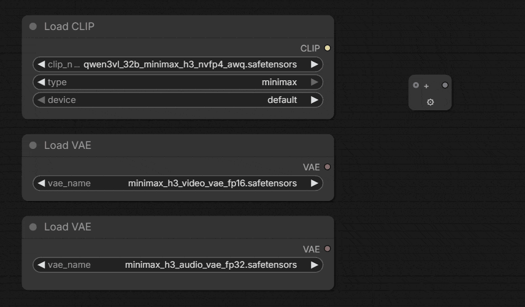

Starts with one empty input and names each field after whatever you plug into it, growing a fresh empty input as each one fills, so there is always exactly one spare. Unplug something in the middle and the gap closes. Up to 16 fields.

The name comes from the far end of the wire — what the producing node calls that output. To choose the names yourself, open the config dialog: a rename sticks to the wire it was made on (it is keyed by the derived name, so it survives re-syncs and falls back to the wire's own name if the wire changes).

The single output is `out`, the packed bundle.

### Unbundle

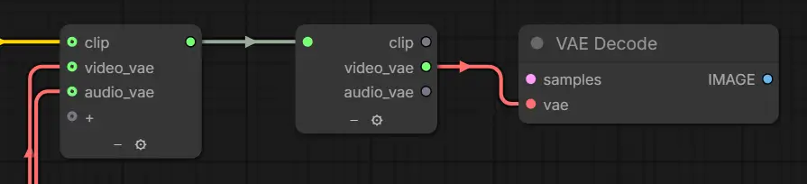

Connect a bundle to `in` and the outputs appear, one per field, labelled with its name.

Wiring something that isn't a bundle into `in` is refused.

Bundles nest: a Bundle's output can itself be a field of another Bundle. Unbundling the outer one puts the inner bundle on the output named after that field, and an Unbundle wired there shows the inner Bundle's fields — the trace follows the wire back through the outer Unbundle to whichever Bundle packed it, at any depth.

The config dialog reorders the outputs and hides the ones a branch does not need; hiding is also how you take a single field, or choose which of a larger bundle to expose. A field with connections cannot be hidden — unplug it first. Once a layout is set it also *pins* the outputs: fields added upstream append at the end instead of shifting the existing pins, and a field that disappears upstream while wired keeps its pin (it outputs `None`, with a log line saying so) rather than silently re-meaning everything below it.

### Collapsing Bundle/Unbundle

The Bundle and Unbundle nodes have a "-"" icon that can be used to collapse them to save space and reduce clutter for even cleaner workflows.


### Peek Bundle

Shows what is actually on a bundle wire: one line per field, with its name and a short description of the value — shape for images, latents and masks, duration and sample rate for audio, the value itself for numbers, booleans and text. Nested bundles list their field names.

Deliberately a summary rather than a dump: printing a batch of images gives pages of numbers that say nothing about whether the right thing is on the wire, while its shape answers exactly that.

The report is printed on the node itself and is also available as a `text` output. Nothing is unpacked or converted, so it costs nothing to leave wired in, and the last run's report is kept when the workflow is reopened.

### Tracing

The names Unbundle offers are traced back through the wire — including through a Lazy Case Switch, through subgraph boundaries, and through KJNodes Set/Get pairs (the Get is followed to its Set, in the same graph or upward through the subgraph the Get sits in).

Tracing back through a **Lazy Case Switch** works when every connected branch packs the same field names — which is precisely when the answer is the same whichever branch ends up running. Branches that pack *different* fields have no single answer, so no names are offered and you give the consumer an explicit list; that list is matched by name, so it stays correct whichever branch wins.

Only sockets that could be carrying the bundle are followed, so a `cases` or `selected` wired in from a Dropdown doesn't make the switch look ambiguous.

Laziness is preserved end to end. A Bundle sits *on* a branch, so when that branch isn't selected the whole thing — bundle and everything feeding it — is skipped, exactly as if the values were wired directly.

## Gates and Switches

These nodes are built around making *optional paths* work well: workflows where an input may or may not be connected, where a branch should only run under some condition, and where downstream nodes need something sensible either way.

### Core concepts: mute, bypass, lazy

ComfyUI offers three different ways to "not run" part of a workflow, and the nodes in this pack are organized around them:

| Mechanism                      | What happens                                                                                                                                      | When to use                                                            |
| ------------------------------ | ------------------------------------------------------------------------------------------------------------------------------------------------- | ---------------------------------------------------------------------- |
| **Mute If** (ExecutionBlocker) | Every node downstream of the blocked output is silently skipped. Cannot be caught or handled downstream.                                          | Kill an entire path when its input is missing.                         |
| **Bypass** (forward `None`)    | Downstream nodes with an *optional* input see it as unconnected and handle the absence themselves. Feeding `None` into a *required* input errors. | Let a tolerant downstream node decide what to do.                      |
| **Lazy** (lazy inputs)         | The unselected branch is never executed at all — its upstream nodes don't run and cost nothing.                                                   | Conditionally skip expensive work (sampling, upscaling, whole groups). |

Mute If and bypass act *downstream* of the gate; only lazy evaluation saves the *upstream* work feeding the unselected side.

Switching a branch off **completely** therefore needs both at once, and which one you are missing is easy to misdiagnose. Laziness alone cannot stop a save node or a preview: every `OUTPUT_NODE` is an execution root, so nothing reaches it *through* a wire and there is no evaluation to prune. A blocker alone cannot stop the work that feeds the gate, because by the time an eager input can be objected to it has already been computed.

### Gates (obvpm/gates)

#### Optional Image / Optional Video / Optional Audio / Optional Latent / Optional Any

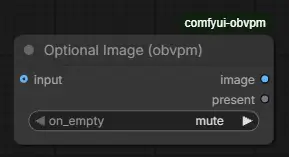

Pass the input through when connected. When the input is missing, the `on_empty` toggle decides what downstream sees:

- `mute` — block the path; every downstream node is skipped.
- `bypass` — output `None`; a downstream node with an optional input treats it as unconnected.

Each gate also has a **`present`** boolean output that is true when an input is connected. It stays live even in mute mode, so it can drive a Lazy Switch's boolean while the value path is dead. `Optional Any` is the wildcard version and accepts any type; its outputs are `value` and `present`.

#### Required Model

The minimal gate: passes a MODEL through. The input is required, so queueing with nothing connected is refused up front — a missing model is a loud error at this node rather than a mystery downstream.

#### Mute If

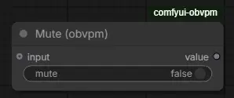

Passes any input through unchanged; when the `mute` boolean is true, blocks everything downstream. The boolean is connectable, so it can be driven by logic (e.g. a gate's `present` through a Boolean invert). Note: nodes *upstream* of the input still run — use a Lazy Switch when you want the upstream work skipped too.

### Switches (obvpm/switches)

#### Lazy Switch

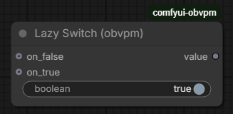

Outputs `on_true` when the boolean is true, else `on_false` — and only the selected branch executes. The entire upstream chain of the unselected side is skipped, making this the way to bypass whole groups of nodes conditionally.

Details that matter in practice:

- An unconnected selected side outputs `None` instead of erroring.
- A branch that was muted by a gate can be "picked back up": select the other side and the workflow continues.
- Drive the boolean from a gate's `present` output to switch automatically based on whether an input exists.

#### Lazy Switch 2 Values / 3 Values

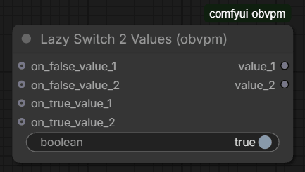

The same switch for several values at once: `boolean` selects between the `on_false_value_*` block and the `on_true_value_*` block, output as `value_1..N`. All slots switch together; unconnected slots on the selected side output `None`.

#### Lazy Case Switch

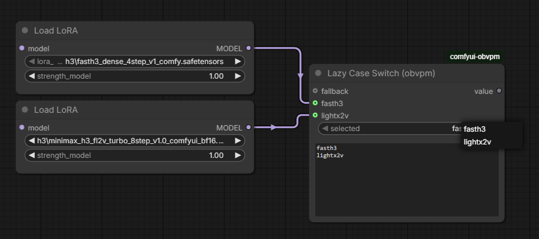

Picks a branch by **name** instead of by a boolean. Write the case names one per line in `cases`; the branch whose line matches `selected` executes and the others never run, exactly like the Lazy Switch.

Everything comes from that one list: **one `on_case` input appears per line, labelled with it**, and `selected` is a dropdown of the same lines. Add a line and a socket appears; remove one and it goes away — unless it is still connected, in which case it stays (labelled as having no line) rather than silently dropping the link.

- Names are matched exactly, with surrounding spaces ignored.
- Blank lines are ignored and do not consume a socket.
- Up to 16 cases.
- No match falls through to `fallback`, which sits above the case pins and stays put as the list is edited. With no fallback connected, the output is `None` (and the log says which name matched nothing).
- Wire a **Dropdown**'s `options` into `cases` and its `value` into `selected` to drive the switch from one shared list. A wired-in list behaves exactly like a typed one — the sockets appear and relabel as the Dropdown is edited. Unwire it and the node goes back to its own text.

#### Lazy Case Switch (auto)

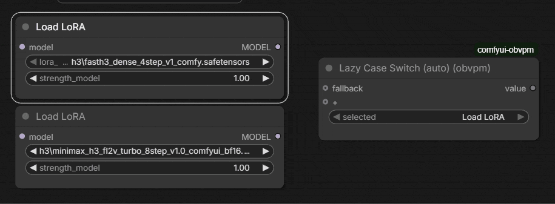

The same switch with no list to write: each branch is named after the node feeding it. Starts with a single empty input and grows another as each one fills, so there is always one spare; unplug one and the gap closes. `selected` is a dropdown of those names.

The name is the source node's **title**, keeping its own spacing and capitals — so rename a node and its branch is renamed with it, and titling the two ends of a fork "Upscale" and "Refine" is all the setup there is. Two branches from identically titled nodes are numbered (`Upscale`, `Upscale_2`).

Use the plain **Lazy Case Switch** when the names should be fixed — driven from a Dropdown, say, or matched against a string from elsewhere that has to keep meaning the same when the wiring changes.

## Misc

### Values and pickers (obvpm/values)

#### Dropdown

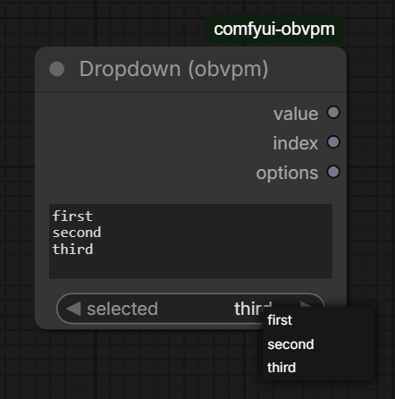

A dropdown you define yourself: type the choices one per line in `options` and pick one from `selected`. Outputs the chosen line (`value`), its position counting from 0 (`index`), and the list itself (`options`).

The `options` passthrough is what pairs it with a Lazy Case Switch: feed it into the switch's `cases` and `value` into its `selected`, and the choices, the branch sockets and their labels all derive from one list.

Editing the options refills the dropdown immediately; an empty selection means the first option. If the selected line is later removed from `options`, the node refuses rather than quietly choosing something else — a saved workflow shouldn't change meaning behind your back.

The options live on the node instance, not in `INPUT_TYPES`: the frontend hands the combo widget a function for its list. The input stays a plain string server-side, so the node still works as a text field if the JS doesn't load.

Note ComfyUI ships an experimental **Custom Combo** node that also offers user-defined options. This one differs in keeping its list as a plain multiline string — visible, diffable, and wire-able into a Lazy Case Switch.

#### First Float / First Int (else fallback)

Output the first connected input that carries a value; if none do, output the `fallback` widget value. Three candidate inputs each (`float1..3` / `int1..3`). Inputs fed by a gate in bypass mode (`None`) are skipped over, so several optional paths fan back into one guaranteed value.

#### Lora Name

Pick a LoRA file and send its name down a wire. The list is the same one a loader shows, read live from the `models/loras` folder. Nothing is loaded here — the value is the **name only** (with any subfolder), so it can be bundled, switched between presets, or fed to several loaders at once. The output is untyped so it plugs straight into a loader's own `lora_name` combo.

#### Sampler Name

Pick a sampler and send it down a wire, instead of setting it on the sampler node itself. Two outputs: `sampler`, typed to match any `sampler_name` combo (KSampler, KSamplerSelect, …), and `sampler_name`, the same choice as a plain string for bundling or captions.

#### Scheduler Name

The same for schedulers: `scheduler` plugs into any scheduler combo, `scheduler_name` is the plain string. The list is read live, so schedulers registered by a pack — this one's `beta57` included — appear here too.

The three pickers keep the socket names of the nodes they replace (see [THIRD_PARTY_NOTICES](THIRD_PARTY_NOTICES.md)), so an existing graph only has to change the node type.

### Clean VRAM (obvpm/misc)

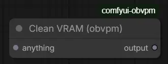

Unloads every loaded model and releases cached VRAM, then passes its input straight through. Put it on the wire between two stages that will not fit in memory together — a decode after a long sample, say. The `anything` input is passed through untouched as `output`; its only job is to place the cleanup in execution order, so wire the output onward to whatever needs the room.

Everything unloaded is reloaded on next use, so the cost is that reload time; place it where that is cheaper than running out of memory. It is an output node, so it runs even when nothing consumes its output.

### beta57 scheduler

This pack automatically adds **beta57** for you if you don't have or don't want to install [RES4LYF](https://github.com/ClownsharkBatwing/RES4LYF).

beta57 is the beta sigma schedule with `alpha=0.5, beta=0.7`, popularized by RES4LYF. It appears in every scheduler dropdown (KSampler, BasicScheduler, [Scheduler Name](#scheduler-name), …) and behaves like a built-in.

## License

[GPL-3.0](LICENSE). See [THIRD_PARTY_NOTICES](THIRD_PARTY_NOTICES.md) for acknowledgments.
